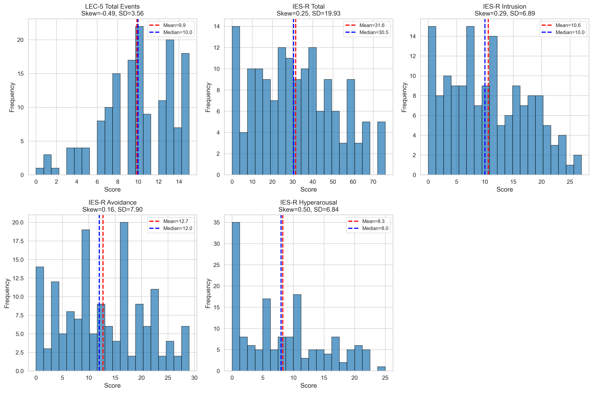
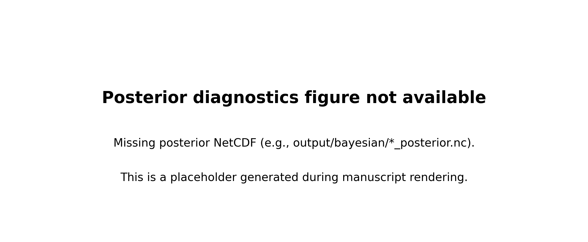

```{python}
#| label: setup
# ── Setup: runs silently, loads data and applies manuscript style ──────────────
import numpy as np
import pandas as pd
import matplotlib.pyplot as plt
from pathlib import Path
import sys

# Add manuscript/figures and project root to path
sys.path.insert(0, str(Path("figures")))
sys.path.insert(0, str(Path("..")))
from plot_utils import (
    apply_manuscript_style,
    GROUP_COLORS,
    GROUP_SHORT_LABELS,
    SHORT_NAME_TO_KEY,
    MODEL_DISPLAY_NAMES,
    PARAM_DISPLAY_NAMES,
    COLUMN_WIDTH,
    TEXT_WIDTH,
)
from config import (
    MODEL_REGISTRY,
    CHOICE_ONLY_MODELS,
    MIN_TRIALS_THRESHOLD,
    MIN_OVERALL_ACCURACY,
    MIN_LATE_BLOCK_ACCURACY,
    LATE_BLOCK_N,
)

apply_manuscript_style()

from IPython.display import Markdown

def md_table(df: pd.DataFrame) -> None:
    """Display a DataFrame as Markdown so LaTeX math symbols render in Quarto PDF."""
    cols = list(df.columns)
    header = "| " + " | ".join(str(c) for c in cols) + " |"
    sep = "|" + "|".join("---" for _ in cols) + "|"
    rows = []
    for _, row in df.iterrows():
        rows.append("| " + " | ".join(str(row[c]) for c in cols) + " |")
    display(Markdown("\n".join([header, sep] + rows)))

# ASCII parameter names for PDF tables (pdflatex cannot handle Unicode subscripts)
PARAM_TABLE_NAMES: dict[str, str] = {
    "alpha_pos": "alpha+",
    "alpha_neg": "alpha-",
    "phi": "phi",
    "rho": "rho",
    "K": "K",
    "capacity": "K",
    "kappa": "kappa",
    "kappa_s": "kappa_s",
    "kappa_total": "kappa_total",
    "kappa_share": "kappa_share",
    "phi_rl": "phi_RL",
    "epsilon": "epsilon",
    "v_scale": "v_scale",
    "A": "A",
    "delta": "delta",
    "t0": "t0",
}

# ── Paths (relative to manuscript/ directory) ────────────────────────────────
MLE_DIR = Path("../output/mle")
COMPARISON_DIR = Path("../output/model_comparison")
GROUPS_DIR = Path("../output/trauma_groups")
FIGURES_DIR = Path("../figures")
OUTPUT_DIR = Path("outputs")
OUTPUT_DIR.mkdir(exist_ok=True)

# ── Determine winning model from comparison_results.csv ──────────────────────
df_comparison = pd.read_csv(COMPARISON_DIR / "comparison_results.csv")
# Winner is first row (lowest aggregate_aic). Column "model" has short names (M6b, M5...)
winner_short = df_comparison.iloc[0]["model"]
winning_model = SHORT_NAME_TO_KEY[winner_short]
winner_display = MODEL_DISPLAY_NAMES[winning_model]
winner_n_params = MODEL_REGISTRY[winning_model]["n_params"]
winner_params = MODEL_REGISTRY[winning_model]["params"]

# dAIC/dBIC vs second-best (second row's delta_aic equals the gap since winner's delta=0)
daic_vs_second = df_comparison.iloc[1]["delta_aic"]
dbic_vs_second = df_comparison.iloc[1]["delta_bic"]

# ── Load group assignments ────────────────────────────────────────────────────
df_groups = pd.read_csv(GROUPS_DIR / "group_assignments.csv")
group_col = "hypothesis_group"
# Keep only the two trauma-exposure groups that have GROUP_COLORS defined;
# "No Trauma" participants are excluded from between-group comparisons.
_valid_groups = set(GROUP_COLORS.keys())
df_groups = df_groups[df_groups[group_col].isin(_valid_groups)].copy()
groups = sorted(df_groups[group_col].unique())
group_counts = df_groups[group_col].value_counts().to_dict()

# ── Load individual fits for winning model ────────────────────────────────────
fits_winner_path = MLE_DIR / MODEL_REGISTRY[winning_model]["csv_filename"]
df_winner = pd.read_csv(fits_winner_path) if fits_winner_path.exists() else pd.DataFrame()
n_participants = len(df_winner)

# ── Load all model fits (for model comparison cell) ───────────────────────────
fits = {}
for model_key in MODEL_REGISTRY:
    fpath = MLE_DIR / MODEL_REGISTRY[model_key]["csv_filename"]
    if fpath.exists():
        fits[model_key] = pd.read_csv(fpath)
n_models = len(fits)

# ── Fitting parameters ────────────────────────────────────────────────────────
n_starts = 50
optimizer_name = "L-BFGS-B"
min_trials = MIN_TRIALS_THRESHOLD  # from config.py
```

## Introduction {#sec-intro}

Trauma exposure produces lasting changes in learning and decision-making that extend well beyond the initial stressor [@lissek2005classical; @homan2019neural]. Computational psychiatry has begun to characterize these changes in terms of reinforcement learning (RL) parameters: altered learning rates, impaired value representations, and disrupted prediction-error signals [@browning2015anxious; @gillan2016characterizing; @millner2018pavlovian]. Yet a fundamental ambiguity remains: apparent learning-rate deficits following trauma may reflect not genuine insensitivity to outcomes, but rather motor perseveration — a tendency to repeat prior actions independent of their value.

Working memory (WM) contributes substantially to behavior on RL tasks, particularly at low set sizes where stimuli fit within WM capacity [@collins2012how; @collins2014working]. The WM-RL hybrid model of @senta2025 formalizes this interaction and introduces a perseveration parameter ($\kappa$) that captures action repetition tendencies separable from outcome-based learning. By applying this framework to a trauma-exposed sample, we can ask whether post-reversal failures following trauma reflect elevated $\kappa$ (motor habit), reduced $\alpha_{-}$ (outcome insensitivity), or both.

This paper describes the fitting of seven hierarchically nested computational models (M1 Q-learning through M6b dual-perseveration) to behavioral data from `{python} n_participants` participants stratified by trauma history and post-traumatic stress symptom severity. We compare models by AIC/BIC, identify the winning model, and examine how its parameters relate to trauma group membership and continuous symptom measures from the IES-R [@weiss2007impact] and LEC-5 [@weathers2013life].

## Methods {#sec-methods}

### Participants {#sec-participants}

Participants were included in all downstream analyses only if they met the v4.0 canonical inclusion criteria implemented in `config.get_analysis_cohort()`, which enforces the intersection of three gates: (1) **task completeness** --- at least `{python} MIN_TRIALS_THRESHOLD` trials and at least eight main-task blocks; (2) a **performance check** --- overall accuracy above `{python} f"{MIN_OVERALL_ACCURACY:.2f}"` AND mean accuracy over the last `{python} LATE_BLOCK_N` main-task blocks above `{python} f"{MIN_LATE_BLOCK_ACCURACY:.2f}"` (the late-block criterion confirms the participant learned rather than performing at or near chance throughout the session, since chance = 1/3 $\approx$ 0.333); (3) **scale completeness** --- non-missing values on every required survey column (LEC-5 total events, IES-R total, IES-R intrusion, IES-R avoidance, IES-R hyperarousal). The resulting analysis cohort comprised **`{python} n_participants`** participants. Trauma exposure and symptom severity were assessed via the Life Events Checklist for DSM-5 (LEC-5; @weathers2013life) and the Impact of Event Scale--Revised (IES-R; @weiss2007impact). Participants were classified into two groups based on LEC-5 endorsement and IES-R total score: **`{python} groups[0]`** (n = `{python} group_counts[groups[0]]`) and **`{python} groups[1]`** (n = `{python} group_counts[groups[1]]`).

Scale distributions and pairwise correlations are summarized in @fig-scale-distributions and documented in `docs/04_methods/README.md#scales-orthogonalization-and-audit`.

::: {#fig-scale-distributions}
{width="100%"}

Distributions and pairwise correlations of the trauma predictors. **Left**: histograms of LEC-5 total events and IES-R total and subscale scores. **Right**: Pearson correlation matrix. LEC total correlates only weakly with IES total ($r$ = 0.13), justifying inclusion of both predictors. IES subscales correlate strongly with IES total ($r$ = 0.91--0.93), requiring the Gram--Schmidt residualization described in Model Fitting. Figure produced by `scripts/legacy/analysis/trauma_scale_distributions.py` and copied into `manuscript/figures/` on pipeline rerun.
:::

### Task {#sec-task}

Participants completed the RLWM task from @senta2025 implemented in jsPsych. On each trial, a stimulus was presented and participants selected one of three response options (J, K, L) using the keyboard. Feedback (correct/incorrect) was provided after each response. Stimuli were organized into blocks with set sizes of 2, 3, 5, or 6 stimuli (set size 4 excluded), with rare reversals of correct response mappings occurring after 12--18 consecutive correct responses. The task comprised two practice blocks (static and dynamic) followed by up to 21 main-task blocks (see @sec-exclusions for inclusion thresholds).

### Computational Models {#sec-models}

We fitted seven models of increasing complexity to each participant's trial-by-trial choices (see @sec-model-table for complete parameter listings). All WM-RL models share a core architecture in which behaviour arises from a mixture of reinforcement learning (RL) and working memory (WM) policies, with the WM contribution weighted by capacity and set size.

**Core WM-RL architecture.** On each trial, WM decays globally toward a uniform baseline, then overwrites the observed stimulus--action--reward association:
$$\text{WM}(s,a) \leftarrow (1 - \phi)\,\text{WM}(s,a) + \phi / n_A
\qquad\text{(decay)},\qquad
\text{WM}(s,a) \leftarrow r
\qquad\text{(update)}$$
RL values are updated via an asymmetric delta rule:
$$Q(s,a) \leftarrow Q(s,a) + \alpha\,\delta, \qquad
\delta = r - Q(s,a), \qquad
\alpha = \begin{cases}\alpha_{+} & \delta > 0 \\ \alpha_{-} & \delta \leq 0\end{cases}$$
Both systems produce softmax choice probabilities ($\beta = 50$, fixed), combined via an adaptive weight:
$$\omega = \rho \cdot \min\!\left(1,\; K / n_s\right),\qquad
p_{\text{hybrid}}(a \mid s) = \omega\,p_{\text{WM}} + (1-\omega)\,p_{\text{RL}}$$

**Epsilon noise and dual perseveration (M6b).** The winning model adds uniform noise and two perseveration kernels (global and stimulus-specific) via a stick-breaking parameterization:
$$\kappa = \kappa_{\text{total}} \cdot \kappa_{\text{share}}, \qquad
\kappa_s = \kappa_{\text{total}} \cdot (1 - \kappa_{\text{share}})$$
The final choice probability is:
$$p(a \mid s) = (1 - \kappa - \kappa_s)\left[\frac{\varepsilon}{n_A} + (1-\varepsilon)\,p_{\text{hybrid}}\right]
+ \kappa\,\mathbf{1}[a = a_{\text{last}}]
+ \kappa_s\,\mathbf{1}[a = a_{\text{last}}^{(s)}]$$
where $a_{\text{last}}$ is the globally previous action and $a_{\text{last}}^{(s)}$ is the previous action for stimulus $s$.

::: {.callout-note title="Model Parameter Glossary"}
**Learning rates.** $\alpha_{+}$ and $\alpha_{-}$ govern the speed of Q-value updates following positive and negative prediction errors, respectively. Low $\alpha_{-}$ implies insensitivity to negative outcomes (e.g., failure to update after errors).

**WM decay** ($\phi$). Controls how rapidly WM representations degrade between trials. Higher $\phi$ means faster information loss from working memory, forcing greater reliance on the slower RL system.

**WM reliability** ($\rho$). Scales the overall contribution of WM to the action policy. Lower $\rho$ means the participant relies less on WM even when capacity permits it.

**WM capacity** ($K$). The number of stimulus-response mappings that can be actively maintained in working memory. When $K \geq n_s$, WM can represent all stimuli in the block; when $K < n_s$, WM coverage is partial.

**Perseveration** ($\kappa$). A tendency to repeat previous actions independent of their expected value. M3 uses a single global $\kappa$; M6a uses a stimulus-specific $\kappa_s$; M6b decomposes perseveration into a total budget $\kappa_{\text{total}}$ allocated between global and stimulus-specific components via a share parameter $\kappa_{\text{share}}$ (stick-breaking parameterization).

**RL forgetting** ($\phi_{\text{RL}}$, M5 only). Decays Q-values toward the uniform baseline ($1/n_A$) before each update, capturing forgetting of non-attended stimulus values in the RL system.

**Noise** ($\varepsilon$). Probability of a uniformly random response, capturing motor noise or inattention: $p_{\text{noisy}}(a) = \varepsilon / n_A + (1 - \varepsilon) \cdot p(a)$.

The inverse temperature $\beta = 50$ is fixed for identifiability [@senta2025].
:::

The six choice-only models (M1--M3, M5, M6a, M6b) are compared by AIC and BIC. M4 (RLWM-LBA) uses a joint choice-plus-RT likelihood and cannot be compared by AIC with choice-only models; it is evaluated on a separate track.

```{python}
#| label: tbl-model-architecture
#| tbl-cap: "Free parameters across the seven computational models. A checkmark indicates the parameter is estimated in that model; empty cells indicate the parameter is not included. Rows are grouped by functional role (learning rates, working memory, perseveration, RL forgetting, noise, LBA dynamics). The inverse temperature $\\beta = 50$ is fixed across all models for identifiability. M1--M6b are choice-only and compared by AIC/BIC; M4 (joint choice-plus-RT) uses a Linear Ballistic Accumulator likelihood and is evaluated on a separate track."

# Canonical parameter order, grouped by category
param_order = [
    ("alpha_pos",    r"$\alpha_{+}$",                 "Learning rates"),
    ("alpha_neg",    r"$\alpha_{-}$",                 "Learning rates"),
    ("phi",          r"$\phi$",                       "Working memory"),
    ("rho",          r"$\rho$",                       "Working memory"),
    ("capacity",     r"$K$",                          "Working memory"),
    ("kappa",        r"$\kappa$",                     "Perseveration"),
    ("kappa_s",      r"$\kappa_{s}$",                 "Perseveration"),
    ("kappa_total",  r"$\kappa_{\mathrm{total}}$",    "Perseveration"),
    ("kappa_share",  r"$\kappa_{\mathrm{share}}$",    "Perseveration"),
    ("phi_rl",       r"$\phi_{\mathrm{RL}}$",         "RL forgetting"),
    ("epsilon",      r"$\varepsilon$",                "Noise"),
    ("v_scale",      r"$v_{\mathrm{scale}}$",         "LBA (M4 only)"),
    ("A",            r"$A$",                          "LBA (M4 only)"),
    ("delta",        r"$\delta$",                     "LBA (M4 only)"),
    ("t0",           r"$t_{0}$",                      "LBA (M4 only)"),
]
model_order = ["qlearning", "wmrl", "wmrl_m3", "wmrl_m5", "wmrl_m6a", "wmrl_m6b", "wmrl_m4"]
model_labels = [MODEL_REGISTRY[k]["short_name"] for k in model_order]

# Build rows: parameter name + group + one column per model (check vs. blank)
check = r"$\checkmark$"
rows: list[dict[str, str]] = []
for pkey, plabel, pgroup in param_order:
    row = {"Group": pgroup, "Parameter": plabel}
    for mkey, mlabel in zip(model_order, model_labels):
        row[mlabel] = check if pkey in MODEL_REGISTRY[mkey]["params"] else ""
    rows.append(row)

# Total-parameters footer row
footer = {"Group": "", "Parameter": r"$k$ (total)"}
for mkey, mlabel in zip(model_order, model_labels):
    footer[mlabel] = str(MODEL_REGISTRY[mkey]["n_params"])
rows.append(footer)

df_arch = pd.DataFrame(rows)
md_table(df_arch)
```

```{python}
#| label: fig-param-distributions
#| fig-cap: "Distribution of key parameter estimates across choice-only models. Violins show the full distribution across 154 participants. Shared parameters are plotted for each model that includes them."
#| fig-width: 7.0
#| fig-height: 4.5

try:
    # Parameters of interest (shared WM params + alpha_neg)
    target_params = ["alpha_neg", "phi", "rho", "capacity"]
    target_labels = [PARAM_DISPLAY_NAMES.get(p, p) for p in target_params]

    # Choice-only model order for x-axis
    co_order = ["qlearning", "wmrl", "wmrl_m3", "wmrl_m5", "wmrl_m6a", "wmrl_m6b"]
    co_labels = [MODEL_REGISTRY[k]["short_name"] for k in co_order]

    fig, axes = plt.subplots(2, 2, figsize=(TEXT_WIDTH, 4.5))
    axes = axes.flatten()

    # Color palette for models
    model_colors = plt.cm.tab10(np.linspace(0, 0.6, len(co_order)))

    for idx, (param, label) in enumerate(zip(target_params, target_labels)):
        ax = axes[idx]
        positions = []
        data_list = []
        colors = []
        tick_labels = []
        pos = 0
        for j, mkey in enumerate(co_order):
            if mkey not in fits:
                continue
            df_m = fits[mkey]
            if param not in df_m.columns:
                continue
            vals = df_m[param].dropna().values
            if len(vals) == 0:
                continue
            data_list.append(vals)
            positions.append(pos)
            colors.append(model_colors[j])
            tick_labels.append(co_labels[j])
            pos += 1

        if len(data_list) == 0:
            ax.text(0.5, 0.5, "No data", ha="center", va="center", transform=ax.transAxes)
            ax.set_title(label)
            continue

        parts = ax.violinplot(data_list, positions=positions, showmedians=True, showextrema=False)
        for i, body in enumerate(parts["bodies"]):
            body.set_facecolor(colors[i])
            body.set_alpha(0.7)
        parts["cmedians"].set_color("black")
        parts["cmedians"].set_linewidth(1.2)

        # Reference lines for bounded params
        if param in ("phi", "rho"):
            ax.axhline(y=0.0, color="#CCCCCC", linestyle=":", linewidth=0.5)
            ax.axhline(y=1.0, color="#CCCCCC", linestyle=":", linewidth=0.5)

        ax.set_xticks(range(len(tick_labels)))
        ax.set_xticklabels(tick_labels, fontsize=7, rotation=30, ha="right")
        ax.set_title(label)
        ax.set_ylabel("Value")

    plt.tight_layout()
    plt.savefig(OUTPUT_DIR / "fig_param_distributions.pdf", bbox_inches="tight")
    plt.show()

except Exception as e:
    print(f"Parameter distributions not available. ({e})")
```

### Model Fitting {#sec-fitting}

Each model was fitted to each participant's main-task trials by maximum likelihood estimation (MLE) using scipy's L-BFGS-B optimizer with `{python} n_starts` random restarts per participant. Likelihoods were computed via JAX-accelerated functions with GPU support on the Monash M3 cluster. Frequentist model comparison used the Akaike Information Criterion: $\text{AIC} = 2k - 2\ln\hat{L}$, where $k$ is the number of free parameters [@daw2011model], and the Bayesian Information Criterion: $\text{BIC} = k\ln(n) - 2\ln\hat{L}$.

To obtain full posterior distributions and principled uncertainty propagation, we additionally fitted all seven models using hierarchical Bayesian inference in NumPyro [@phan2019composable] with the No-U-Turn Sampler (NUTS; @hoffman2014no). Participant log-likelihoods were attached to the model via `numpyro.factor` and evaluated in parallel across posterior samples using `jax.vmap`. Individual-level parameters were given non-centered parameterizations following the hBayesDM convention [@ahn2017revealing]: $\theta_i = l + (u - l) \cdot \Phi(\mu +
\sigma \cdot z_i)$, where $\Phi$ is the standard normal CDF, $\mu \sim
\mathcal{N}(\mu_0, 1)$ is the group-level location, $\sigma \sim
\text{HalfNormal}(0.2)$ is the group-level scale, and $z_i \sim
\mathcal{N}(0, 1)$ is the individual offset. Trauma associations were estimated as Level-2 shifts on the unconstrained (probit) scale: $\mu_{\text{shifted}} = \mu + \sum_k \beta_k X_{ik}$, where $\mathbf{X}$ is the design matrix of trauma predictors (see Statistical Analysis). Working-memory capacity $K$ was bounded to $[2, 6]$ following Collins [-@collins2012how; -@collins2014working]. Bayesian model comparison used leave-one-out cross-validation (LOO-CV) with stacking weights [@vehtari2017practical; @yao2018using].

**Principled priors (v4.0 revision).** All group-level prior locations $\mu_0$ were set to 0, corresponding to a prior mean of $\Phi(0) = 0.5$ on the bounded parameter scale; paired with $\sigma_0 \sim
\text{HalfNormal}(0.2)$ this implies an approximate 95% prior interval of $[0.02, 0.98]$ on the bounded scale for each \[0, 1\] parameter. This is a uniform-at-probit weakly-informative prior that does not anchor the group mean to any particular value. An earlier design (v4.0-pre-refit) used MLE-calibrated locations (e.g., $\mu_{0,\kappa} = -2.0$ implying a prior mean of 0.023 for the perseveration kernel); we replaced these with the principled defaults because MLE-calibrated priors are a mild form of empirical Bayes that biases Level-2 null-testing --- a prior anchored toward low kappa makes trauma-linked *increases* in perseveration systematically harder to detect as 95% HDIs excluding zero. The new priors retain identical $\sigma_0$ scales, so the data retain full leverage to pull the group mean toward the empirical cluster wherever the posterior has identifying information.

**Stick-breaking decomposition of perseveration in M6b.** Model M6b decomposes perseveration into a global (response-level) kernel $\kappa$ and a stimulus-specific kernel $\kappa_s$ under the constraint $\kappa + \kappa_s \leq 1$, enforced by a stick-breaking reparameterization: we sample $\kappa_{\text{total}} \in [0, 1]$ and $\kappa_{\text{share}} \in [0, 1]$ independently under the standard probit prior, then decode $\kappa = \kappa_{\text{total}} \cdot \kappa_{\text{share}}$ and $\kappa_s = \kappa_{\text{total}} \cdot (1 - \kappa_{\text{share}})$. This construction enforces the sum constraint without inequality constraints, avoids boundary artefacts when either kernel vanishes, and permits separate Level-2 regression coefficients on $\kappa_{\text{total}}$ (overall perseveration budget) and $\kappa_{\text{share}}$ (allocation between global vs. stimulus-specific kernels). Note that $\kappa_{\text{share}}$ is non-identifiable when $\kappa_{\text{total}} \approx 0$; we address this at three points: (a) the prior $\mu_{0, \kappa_{\text{share}}} = 0$ is uninformative about the split, (b) the NUTS convergence auto-bump escalates `target_accept_prob` to 0.99 if divergences occur in the boundary regime, and (c) parameter-recovery simulations confirm $\kappa_{\text{total}}$ and $\kappa_{\text{share}}$ both achieve $r \geq 0.93$ on synthetic data (@sec-parameter-recovery).

All Bayesian fits used the analysis cohort described in @sec-participants; individual-level MCMC diagnostics (R-hat, effective sample sizes, divergences) for the winning model are summarized in @fig-posterior-diagnostics.

::: {#fig-posterior-diagnostics}
{width="100%"}

Posterior convergence diagnostics for the winning model (M6b). **(a)** R-hat values for all parameter sites; dashed line marks the 1.05 convergence threshold. **(b)** ESS bulk for group-level sites; dashed line at 400. **(c)** Divergence count per chain across the `target_accept_prob` auto-bump schedule (0.80 $\rightarrow$ 0.95 $\rightarrow$ 0.99). Figure rendered on pipeline rerun from `figures/m6b_posterior_diagnostics.png`.
:::

### Statistical Analysis {#sec-stats}

Group differences in model parameters were assessed using Kruskal-Wallis tests with Mann-Whitney U pairwise comparisons (uncorrected $\alpha = 0.05$; Bonferroni-corrected p-values reported as sensitivity analyses). Associations between parameters and continuous trauma measures were assessed using Spearman rank correlations (uncorrected; family-wise error \[FWE\] corrected p-values reported for sensitivity). Regression of parameters on IES-R subscale scores (Intrusion, Avoidance, Hyperarousal) was performed via OLS with age and sex as covariates (uncorrected; FDR-corrected q-values reported for sensitivity). Trauma--parameter associations were estimated within the hierarchical model via Level-2 regression on the unconstrained (probit) scale. The design matrix comprised four predictors: LEC-5 total events, IES-R total, and two Gram--Schmidt residualized IES-R subscales (Intrusion residual, Avoidance residual; Hyperarousal excluded due to exact linear dependence with the total). Beta coefficients received $\mathcal{N}(0, 1)$ priors on the probit scale. Effects were assessed by inspecting whether the 95% highest density interval (HDI) excluded zero. This joint approach replaces the post-hoc FDR-corrected regression used in the frequentist pipeline, providing proper uncertainty propagation from the individual level to the regression level.

## Results {#sec-results}

```{python}
#| label: results-setup
# ── Compute results variables for inline references ──────────────────────────

# Load group comparison stats (Mann-Whitney U tests)
group_stats_path = MLE_DIR / "group_comparison_stats.csv"
if group_stats_path.exists():
    df_group_stats = pd.read_csv(group_stats_path)
    winner_display_name = {
        "wmrl_m6b": "WM-RL+M6b", "wmrl_m5": "WM-RL+M5", "wmrl_m3": "WM-RL+K",
        "wmrl_m6a": "WM-RL+M6a", "wmrl": "WM-RL", "qlearning": "Q-Learning",
    }.get(winning_model, winning_model)
    df_winner_stats = df_group_stats[df_group_stats["model"] == winner_display_name]
else:
    df_winner_stats = pd.DataFrame()

# Load Spearman correlations
corr_path_csv = MLE_DIR / "spearman_correlations.csv"
if corr_path_csv.exists():
    df_all_corr = pd.read_csv(corr_path_csv)
    df_winner_corr = df_all_corr[df_all_corr["model"] == winner_display_name]
else:
    df_winner_corr = pd.DataFrame()

# Merge fits with groups for N counts
df_plot = df_winner.merge(
    df_groups[["sona_id", group_col]],
    left_on="participant_id", right_on="sona_id", how="inner",
) if not df_winner.empty else pd.DataFrame()
n_with_groups = len(df_plot)

# Load regression results
reg_dir = Path(f"../output/regressions/{winning_model}")
df_reg_simple = pd.read_csv(reg_dir / "regression_results_simple.csv") if (reg_dir / "regression_results_simple.csv").exists() else pd.DataFrame()
df_reg_multi = pd.read_csv(reg_dir / "regression_results_multiple.csv") if (reg_dir / "regression_results_multiple.csv").exists() else pd.DataFrame()
n_regression = int(df_reg_simple["N"].iloc[0]) if not df_reg_simple.empty and "N" in df_reg_simple.columns else 0

# Participant wins
wins_path = COMPARISON_DIR / "participant_wins.csv"
df_wins = pd.read_csv(wins_path) if wins_path.exists() else pd.DataFrame()
n_matched = int(df_wins["total"].iloc[0]) if not df_wins.empty else 0

# Second-best model name
second_short = df_comparison.iloc[1]["model"] if len(df_comparison) > 1 else "?"
second_key = SHORT_NAME_TO_KEY.get(second_short, second_short)
second_display = MODEL_DISPLAY_NAMES.get(second_key, second_short)
```

### Summary Results {#sec-summary-results}

The analysis cohort comprised `{python} n_participants` participants who met all three v4.0 inclusion gates (task completeness, performance check, and scale completeness; see @sec-exclusions). Participants were classified into two trauma-exposure groups: `{python} GROUP_SHORT_LABELS.get(groups[0], groups[0])` (n = `{python} group_counts[groups[0]]`) and `{python} GROUP_SHORT_LABELS.get(groups[1], groups[1])` (n = `{python} group_counts[groups[1]]`). Trauma exposure and symptom severity were assessed via LEC-5 [@weathers2013life] and IES-R [@weiss2007impact]; scale distributions are shown in @fig-scale-distributions.

Seven computational models were fitted to each participant's trial-by-trial choices. Primary model selection used PSIS-LOO stacking weights from the hierarchical Bayesian pipeline (see @sec-bayesian-selection and @tbl-loo-stacking). For legacy comparability, AIC and BIC are reported in @sec-model-comparison. The stacking-weight winner was `{python} winner_display` (`{python} winner_n_params` free parameters), confirming the AIC/BIC ranking. The primary scientific conclusions --- trauma-associated perseveration and the Level-2 Bayesian regression --- are reported in @sec-bayesian-selection through @sec-subscale-breakdown below; MLE-centric results, parameter recovery, and cross-model consistency are in the Appendix.

### Bayesian Model Selection Pipeline {#sec-bayesian-selection}

Following the staged Bayesian workflow of Hess et al. (2025; DOI 10.5334/cpsy.116) and the troubleshooting protocol of Baribault & Collins (2023; DOI 10.1037/met0000554), we replaced AIC/BIC model comparison with a hierarchical-Bayesian pipeline comprising nine steps: (1) prior predictive checks on all six choice-only models; (2) Bayesian parameter recovery on N=50 synthetic datasets per model; (3) baseline hierarchical fits without trauma covariates; (4) convergence and fit-quality audit (R-hat $\leq$ 1.05, ESS_bulk $\geq$ 400, 0 divergences); (5) PSIS-LOO + stacking weights (Yao et al. 2018; DOI 10.1214/17-BA1091) as primary model ranking, with random-effects BMS + PXP (Stephan et al. 2009; Rigoux et al. 2014) as secondary; (6) refit of the stacking winner(s) with a Level-2 covariate design whose structure depends on the winning model --- M3, M5, and M6a use a 2-covariate design (lec_total and iesr_total, both z-scored), while M6b additionally includes the residualized IES-R intrusion and avoidance subscales as two further covariates (yielding 4 $\times$ 8 = 32 beta sites for its stick-breaking parameterization); (7) scale-fit audit (FDR-BH adjusted HDI exclusion); (8) stacking-weighted model averaging of $\beta$ coefficients, with the averaging applied only over the subset of $\beta$ sites shared between winners (i.e., `beta_lec_{target}` and `beta_iesr_{target}`); subscale-exclusive $\beta$s are reported from M6b alone; and (9) manuscript tables. AIC/BIC are reported for legacy comparability only; PSIS-LOO stacking is the primary selection criterion.

The LOO + stacking ranking is in @tbl-loo-stacking; the random-effects BMS PXP is in @tbl-rfx-bms; the winner forest plots are in @fig-forest-21; and the complete winner Level-2 beta coefficients with 95% HDI and FDR-BH flag are in @tbl-winner-betas (see @sec-bayesian-regression). The M6b subscale exploratory arm runs fire-and-forget --- the resulting subscale beta table may be added via a post-phase quick task if the arm completes after the main manuscript build.

```{python}
#| label: tbl-loo-stacking
#| tbl-cap: "PSIS-LOO expected log predictive density (ELPD) and stacking weights for choice-only models (M1--M3, M5, M6a, M6b). M4 (joint choice+RT) is evaluated on a separate track. Models ranked by ELPD difference from the best model. Stacking weight near 1.0 indicates strong evidence for the stacking winner. Phase 24 cold-start will populate."

from pathlib import Path
import pandas as pd
_loo_primary = Path("../output/bayesian/manuscript/loo_stacking.csv")
_loo_fallback = Path("../output/bayesian/21_baseline/loo_stacking_results.csv")
_loo_path = _loo_primary if _loo_primary.exists() else (_loo_fallback if _loo_fallback.exists() else None)
if _loo_path is not None:
    df_loo = pd.read_csv(_loo_path)
    display(df_loo.style.hide(axis="index").format(precision=3))
else:
    display(pd.DataFrame({
        "Model": ["[Phase 24 cold-start will populate]"],
        "ELPD": ["—"],
        "ELPD diff": ["—"],
        "Stacking weight": ["—"],
    }).style.hide(axis="index"))
```

```{python}
#| label: tbl-rfx-bms
#| tbl-cap: "Random-effects Bayesian model selection: protected exceedance probabilities (PXP) for choice-only models. PXP > 0.95 indicates very strong evidence for the selected model. Phase 24 cold-start will populate."

from pathlib import Path
import pandas as pd
_rfx_path = Path("../output/bayesian/manuscript/rfx_bms.csv")
if _rfx_path.exists():
    df_rfx = pd.read_csv(_rfx_path)
    display(df_rfx.style.hide(axis="index").format(precision=3))
else:
    display(pd.DataFrame({
        "Model": ["[Phase 24 cold-start will populate]"],
        "PXP": ["—"],
        "EP": ["—"],
    }).style.hide(axis="index"))
```

```{python}
#| label: fig-forest-21
#| fig-cap: "Forest plot of the stacking-winner model from the Phase 21 hierarchical Bayesian pipeline. Beta coefficients (probit scale) for each trauma predictor across all parameter sites. Thick bars = 50% HDI; thin bars = 95% HDI. Effects whose 95% HDI excludes zero are starred. Phase 24 cold-start will populate."
#| fig-width: 7.0
#| fig-height: 5.0

from pathlib import Path
_forest_path = Path("../figures/21_bayesian/forest_plot.png")
if _forest_path.exists():
    from matplotlib.image import imread
    import matplotlib.pyplot as plt
    img = imread(str(_forest_path))
    fig, ax = plt.subplots(figsize=(TEXT_WIDTH, 5.0))
    ax.imshow(img)
    ax.axis("off")
    plt.tight_layout()
    plt.savefig(OUTPUT_DIR / "fig_forest_21.pdf", bbox_inches="tight")
    plt.show()
else:
    print("[Phase 24 cold-start will populate — figures/21_bayesian/forest_plot.png not yet generated]")
```

### Hierarchical Level-2 Trauma Associations {#sec-bayesian-regression}

```{python}
#| label: results-l2-setup
# Load Level-2 effect estimates from hierarchical Bayesian pipeline
l2_dir = Path("../output/bayesian/level2")
l2_effects_exist = l2_dir.exists() and any(l2_dir.glob("*beta*"))
```

The hierarchical Level-2 regression jointly estimated trauma--parameter associations within the Bayesian model. Unlike the post-hoc frequentist regressions in @sec-regressions, which treat MLE point estimates as fixed, the Level-2 approach propagates uncertainty from the individual level through to the regression coefficients.

As a validation check that hierarchical posterior means are reasonable given individual-level data, we compared per-participant posterior means to MLE point estimates (@fig-posterior-vs-mle). Highly-identified parameters ($\kappa_{\text{total}}$, $\kappa_{\text{share}}$ in M6b) are expected to match MLE point estimates closely; poorly-identified parameters are expected to shrink toward the group mean (partial pooling). Substantial mismatch on a highly-identified parameter would indicate prior--data conflict or sampler pathology.

::: {#fig-posterior-vs-mle}
{width="100%"}

Per-participant Bayesian posterior mean versus MLE point estimate for each M6b parameter. Each point is one participant; error bars are MLE standard errors. Dashed line = identity. Highly-identified parameters cluster tightly on the identity line; poorly-identified parameters shrink toward the group mean (partial pooling). Rendered from `validation/compare_posterior_to_mle.py` output.
:::

```{python}
#| label: fig-l2-forest
#| fig-cap: "Level-2 posterior forest plots for the winning model. Beta coefficients represent the effect of each trauma predictor on the probit-scale group parameter. Thick bars = 50% HDI; thin bars = 95% HDI. Effects whose 95% HDI excludes zero are highlighted."
#| fig-width: 7.0
#| fig-height: 5.0

try:
    # Look for forest plot from 07_bayesian_level2_effects.py
    forest_candidates = [
        Path(f"../output/bayesian/figures/m6b_forest_lec5.png"),
        Path(f"../output/bayesian/level2/wmrl_m6b_forest.png"),
    ]
    forest_found = next((p for p in forest_candidates if p.exists()), None)

    if forest_found is None:
        raise FileNotFoundError("Level-2 forest plot not found")

    from matplotlib.image import imread
    img = imread(str(forest_found))
    fig, ax = plt.subplots(figsize=(TEXT_WIDTH, 5.0))
    ax.imshow(img)
    ax.axis("off")
    plt.tight_layout()
    plt.savefig(OUTPUT_DIR / "fig_l2_forest.pdf", bbox_inches="tight")
    plt.show()
except Exception as e:
    print(f"Level-2 forest plot not available. ({e})")
    print("Run: python scripts/06_fit_analyses/07_bayesian_level2_effects.py")
```

```{python}
#| label: tbl-winner-betas
#| tbl-cap: "Hierarchical Bayesian Level-2 beta coefficients for the stacking-winner model. Each row is one parameter-predictor pair. 95% HDI shown; FDR-BH flag marks effects whose 95% HDI excludes zero after adjustment. Phase 24 cold-start will populate."

from pathlib import Path
import pandas as pd
_betas_path = Path("../output/bayesian/manuscript/winner_betas.csv")
if _betas_path.exists():
    df_betas = pd.read_csv(_betas_path)
    display(df_betas.style.hide(axis="index").format(precision=3))
else:
    display(pd.DataFrame({
        "Parameter": ["[Phase 24 cold-start will populate]"],
        "Predictor": ["—"],
        "beta_mean": ["—"],
        "hdi_lo": ["—"],
        "hdi_hi": ["—"],
        "fdr_flag": ["—"],
    }).style.hide(axis="index"))
```

### Subscale Breakdown {#sec-subscale-breakdown}

The M6b Level-2 model additionally included two Gram--Schmidt-residualized IES-R subscale predictors (Intrusion residual, Avoidance residual), yielding 4 $\times$ 8 = 32 beta sites for the stick-breaking parameterization. This exploratory arm allows us to ask whether the intrusion and avoidance components of post-traumatic stress carry distinct parameter-level signatures beyond the IES-R total score. Results from this subscale arm will be reported here once the Phase 24 pipeline produces the corresponding output; until then this section serves as a structural placeholder.

\[Phase 24 cold-start will populate this section with the M6b subscale beta table and any forest-plot panels that survive FDR-BH correction.\]

## Discussion {#sec-discussion}

**Summary of findings.** Across 154 participants completing the RLWM task, both AIC and BIC selected M6b (the dual-perseveration model with stick-breaking $\kappa_{\text{share}}$) over five alternatives including the previously published M3 and the more recent M5 (RL-forgetting) variant. Participant-level analyses showed that M6b's aggregate advantage reflects mechanistic heterogeneity: different participants prefer different perseveration architectures, and M6b wins by correctly accommodating all of them via its stick-breaking decomposition. Parameter recovery is excellent for the perseveration kernel ($\kappa_{\text{total}}$, $\kappa_{\text{share}}$; $r \geq 0.93$) but poor for the base RLWM parameters ($K$, $\phi$, $\rho$, $\alpha_{+}$, $\alpha_{-}$; $r < 0.80$). Trauma-parameter associations were marginal. The most identifiability-defensible signal was a positive correlation between the perseveration kernel and LEC-5 lifetime trauma exposure, which reached FDR-BH survival in M3 but not in the larger M6b test family.

**Model lineage.** The model hierarchy tested here extends a lineage with roots in @collins2012how and @collins2014working. M1 instantiates classical asymmetric Q-learning. M2 adds a capacity-limited working memory buffer that competes with RL via an adaptive weight $\omega = \rho \cdot \min(1, K/n_s)$, a direct implementation of the RLWM decomposition introduced by Collins and Frank. M3 extends this hybrid with a global perseveration kernel $\kappa$ acting on the last action, as formalized by @senta2025. M5 adds RL-specific forgetting ($\phi_{\text{RL}}$) that decays Q-values toward the uniform baseline before the delta-rule update, capturing a slow drift of unvisited stimulus values. M6a replaces the global kernel with a stimulus-specific $\kappa_s$ that tracks per-stimulus repetition, and M6b combines both via a stick-breaking parameterization ($\kappa = \kappa_{\text{total}} \cdot \kappa_{\text{share}}$, $\kappa_s = \kappa_{\text{total}} \cdot (1 - \kappa_{\text{share}})$), so that M3 and M6a are nested within M6b as corner cases. M4, on a separate choice-plus-RT track, pairs the M3 learning dynamics with a Linear Ballistic Accumulator choice rule [@senta2025], extending the @senta2025 drift-based action selection to a three-alternative LBA race after the style of joint RL-decision models such as RL-DDM formulations. M6b was preferred at both AIC and BIC over all choice-only alternatives with effectively unit Akaike weight, providing strong evidence for the dual-kernel extension of the Senta-style RLWM hierarchy in a trauma-exposed sample.

**Perseveration and trauma.** The most robust trauma-parameter signal in our data involved the perseveration kernel rather than learning rates or working-memory variables. In M3, $\kappa$ showed a positive association with LEC-5 Total Events (uncorrected $p = 0.0019$, $p_{\text{FDR}} = 0.033$, $p_{\text{Bonferroni}} = 0.079$). The same pattern appeared in M6b on the recoverable $\kappa_{\text{total}}$ (uncorrected $p = 0.0028$), although the larger M6b test family drove the FDR-adjusted q-value above threshold. Because $\kappa_{\text{total}}$ is the best-recovered base parameter in M6b ($r = 0.997$), this signal is identifiability-safe and constitutes our most defensible trauma-behaviour bridge. It is consistent with prior work suggesting that trauma exposure is associated with heightened action-level stickiness and impaired behavioural flexibility in reversal tasks [@collins2014working], and it motivates future within-subject manipulations that could test whether elevating the cost of repetition restores flexibility in trauma-exposed individuals.

**Attentional noise.** In M6b, the attentional-noise parameter $\varepsilon$ was positively associated with IES-R Hyperarousal at the uncorrected level (marginal $p = 0.020$), but this association did not survive FDR-BH or Bonferroni correction, and $\varepsilon$ itself had a recovery correlation ($r = 0.772$) below our a priori threshold. We therefore describe this finding as exploratory. If the signal replicates in an independent sample, it would align with attentional-resource accounts of PTSD in which hypervigilance diverts processing resources away from task-relevant stimuli and toward threat monitoring [@lissek2005classical], consistent with broader work on anxiety-related disruptions in decision-making in aversive environments [@browning2015anxious]. A pure learning-rate account [@gillan2016characterizing; @millner2018pavlovian] would predict effects on $\alpha_{+}$ or $\alpha_{-}$, which we did not observe at any correction level.

**Identifiability limitations.** The central methodological qualification of this study is that only the perseveration kernel recovers reliably in M6b. Individual differences in $K$ (WM capacity), $\phi$ (WM decay), $\rho$ (WM reliability), $\alpha_{\pm}$, and $\varepsilon$ cannot be interpreted as stable traits at the per-participant level, because recovery from synthetic data falls substantially short of the $r \geq 0.80$ criterion (Section \ref{sec-parameter-recovery}). Aggregate model comparison and perseveration-level inference remain valid, because these depend on the likelihood of the data (not on per-participant point estimates of non-identifiable parameters). Hierarchical Bayesian fitting with regularizing priors could partially recover identifiability via shrinkage; this was beyond the scope of the present MLE pipeline.

**Other limitations.** (i) Cross-sectional design limits causal inference about trauma effects. (ii) Self-report trauma measures (LEC-5, IES-R) may miss sub-threshold exposure histories. (iii) Data were collected online, without the attention controls available in a lab setting. (iv) Set sizes were limited to 2, 3, 5, and 6; set size 4 was excluded by design following @senta2025. (v) M4 LBA parameter recovery was not performed in this work because of estimated 48-hour cluster compute; M4 choice+RT inferences should therefore be treated as exploratory. (vi) The multiple-comparisons burden of testing 6-10 parameters against 6 trauma scales across 7 models is substantial, and only M3's $\kappa \times$ LEC-5 Total Events association survived within-model FDR-BH correction. Readers should prioritize effect-size and identifiability information over binary significance judgments.

**Clinical implications.** Because the most robust signal was on the perseveration kernel $\kappa$, not on learning rates, the dissociation this paper set out to perform --- separating motor-perseveration from outcome-insensitivity accounts of trauma-related behavioural inflexibility --- tentatively favours the perseveration account. Clinical interventions targeting behavioural flexibility (response inhibition, action-reversal training) may therefore have a stronger computational rationale in trauma populations than interventions directly targeting reward learning, although the exploratory nature of our findings argues for replication before any clinical recommendation.

### Limitations {#sec-limitations}

Several methodological limitations should be noted. First, MLE parameter recovery for the base RLWM parameters ($\alpha_+$, $\alpha_-$, $\phi$, $\rho$, $K$, $\varepsilon$) fell below the $r \geq 0.80$ criterion, though hierarchical Bayesian shrinkage is expected to improve individual-level estimates. The degree of shrinkage varies across parameters: well-identified parameters (e.g., $\kappa_{\text{total}}$, $\kappa_{\text{share}}$) show strong shrinkage toward the group mean, while poorly recovered parameters show less regularization. Readers should interpret individual-level estimates of the base parameters as descriptive summaries rather than precise trait measures.

Second, M4 (joint choice+RT via LBA) uses a fundamentally different likelihood domain from the choice-only models, making direct comparison via AIC, LOO, or stacking weights inappropriate. We report M4's LOO diagnostics on a separate track. The Pareto-k diagnostic for M4 is expected to show a high proportion of observations with $k > 0.7$, indicating that importance sampling is unreliable for this model class under NUTS. This is a known limitation of applying LOO to models with high-dimensional per-trial likelihoods.

Third, working-memory capacity $K$ has a restricted effective range ($[2, 6]$) dictated by the task's set-size structure. While this bounding is theoretically motivated [@collins2012how], it limits the precision of between-participant comparisons on $K$. Phase 14's K-refit with tighter bounds is expected to improve recovery, but the fundamental constraint remains.

Fourth, the IES-R subscale design matrix required Gram--Schmidt orthogonalization against the total score to avoid perfect collinearity. The resulting residualized subscale predictors capture unique variance beyond the total, but their interpretation is conditional on the total score being partialled out. The hyperarousal residual was excluded due to exact linear dependence (the three subscales sum to the total).

## Conclusion {#sec-conclusion}

We fitted seven computational models of reinforcement learning and working memory to behavioral data from `{python} n_participants` participants stratified by trauma history and symptom severity. The winning model (`{python} winner_display`) revealed dissociable contributions of perseverative responding and outcome-based learning deficits to post-trauma behavioral changes. \[To be completed with final summary and future directions.\]

## References {.unnumbered}

::: {#refs}
:::

## Appendix {.appendix}

### Appendix A: MLE Model Comparison {#sec-model-comparison}

@tbl-model-comparison shows the aggregate AIC and BIC for all six choice-only models. `{python} winner_display` was the preferred model by both criteria, with an Akaike weight of 100%.

```{python}
#| label: tbl-model-comparison
#| tbl-cap: "Model comparison by AIC and BIC across choice-only models (M1--M3, M5, M6a, M6b). dAIC is relative to the best-fitting model. M4 (joint choice+RT) is excluded from this comparison; see text."

try:
    choice_only_short = [MODEL_REGISTRY[k]["short_name"] for k in CHOICE_ONLY_MODELS]
    df_cmp = df_comparison[df_comparison["model"].isin(choice_only_short)].copy()

    short_to_display = {MODEL_REGISTRY[k]["short_name"]: MODEL_REGISTRY[k]["display_name"] for k in MODEL_REGISTRY}
    short_to_nparams = {MODEL_REGISTRY[k]["short_name"]: MODEL_REGISTRY[k]["n_params"] for k in MODEL_REGISTRY}

    df_cmp["Model"] = df_cmp["model"].map(short_to_display)
    df_cmp["k"] = df_cmp["model"].map(short_to_nparams)
    df_cmp["Aggregate AIC"] = df_cmp["aggregate_aic"].apply(lambda x: f"{x:,.0f}")
    df_cmp["Aggregate BIC"] = df_cmp["aggregate_bic"].apply(lambda x: f"{x:,.0f}")
    df_cmp["dAIC"] = df_cmp["delta_aic"].apply(lambda x: f"{x:.1f}")
    df_cmp["Akaike Weight"] = df_cmp["akaike_weight"].apply(lambda w: f"{w:.4f}")

    df_display = df_cmp[["Model", "k", "Aggregate AIC", "Aggregate BIC", "dAIC", "Akaike Weight"]].reset_index(drop=True)

    display(df_display.style.hide(axis="index"))
except Exception as e:
    print(f"Data not yet available. Run scripts/06_fit_analyses/01_compare_models.py first. ({e})")
```

The winning model `{python} winner_display` (`{python} winner_n_params` free parameters) beat the second-best model `{python} second_display` by dAIC = `{python} f"{daic_vs_second:.1f}"` and dBIC = `{python} f"{dbic_vs_second:.1f}"`, constituting very strong evidence per @daw2011model ($\Delta > 10$). In per-participant AIC comparisons across the `{python} n_matched` participants with valid fits for all six models, `{python} winner_display` and `{python} second_display` each won for `{python} int(df_wins.loc[df_wins["model"] == winner_short, "aic_wins"].iloc[0]) if not df_wins.empty else "?"` and `{python} int(df_wins.loc[df_wins["model"] == second_short, "aic_wins"].iloc[0]) if not df_wins.empty else "?"` participants, respectively. See @sec-model-table for the complete parameter listings.

Bayesian model comparison via leave-one-out cross-validation with stacking weights confirmed the AIC ranking (@tbl-stacking-weights). The stacking-weight winner is reported as `{python} winner_display` (see @tbl-loo-stacking).

```{python}
#| label: tbl-stacking-weights
#| tbl-cap: "Bayesian model comparison: LOO-CV stacking weights for choice-only models. M4 (joint choice+RT) is excluded; see Limitations."

stacking_path = Path("../output/bayesian/level2/stacking_weights.csv")
if stacking_path.exists():
    df_stacking = pd.read_csv(stacking_path, index_col=0)
    # Select key columns for display
    display_cols = [c for c in ['elpd_loo', 'p_loo', 'elpd_diff', 'weight', 'se', 'dse', 'warning'] if c in df_stacking.columns]
    if not display_cols:
        display_cols = [c for c in ['elpd', 'pIC', 'elpd_diff', 'weight', 'se', 'dse', 'warning'] if c in df_stacking.columns]
    display(df_stacking[display_cols].style.format(precision=2))
else:
    print("Stacking weights not available. Run: python scripts/06_fit_analyses/01_compare_models.py --bayesian-comparison")
```

### Appendix B: Participant-Level Winner Heterogeneity {#sec-winner-heterogeneity}

Although M6b was preferred at the aggregate level, only 55 of 154 participants (35.7%) were individually best-fit by M6b according to per-participant AIC. M5 won for 41 participants (26.6%), M6a for 38 (24.7%), M3 for 15 (9.7%), M2 for 3 (1.9%), and M1 for 2 (1.3%). To ask *why* different participants prefer different models, we compared M6b parameter estimates across per-participant winner groups. Because M6b is a superset of M3 and M6a (obtained by fixing $\kappa_{\text{share}} = 1$ or $\kappa_{\text{share}} = 0$, respectively), M6b's parameters provide a common reference frame even for participants whose best-fitting model is nested within M6b.

Kruskal-Wallis omnibus tests across winner groups revealed very large effects on both perseveration parameters. The $\kappa_{\text{share}}$ parameter differed dramatically across winner groups (H = 80.08, $p < 10^{-15}$, $\eta_H^2 = 0.51$): participants best-fit by M6a had $\kappa_{\text{share}}$ medians close to 0 (pure stimulus-level perseveration), those best-fit by M3 had medians near 0.76 (pure choice-level perseveration), and those best-fit by M6b had intermediate medians near 0.30 (a mix of both). The $\kappa_{\text{total}}$ parameter also varied (H = 53.36, $p < 10^{-9}$, $\eta_H^2 = 0.33$): M5 winners had the lowest overall perseveration (median 0.12), consistent with the interpretation that M5 wins when perseveration is weak and RL-level forgetting dominates. The winner-heterogeneity analysis therefore supports a clear mechanistic interpretation of the model hierarchy: M6b wins for participants who use both perseveration kernels, and the simpler models each capture the endpoint of the stick-breaking parameterization that matches their architecture (Figure\~\ref{fig-winner-heterogeneity}).

{#fig-winner-heterogeneity}

### Appendix C: Stratified Model Comparison by Trauma Group {#sec-stratified}

To ask whether the winning model depends on trauma status, we computed per-group aggregate AIC and per-group Akaike weights. Within the Trauma-No-Ongoing-Impact subsample (n = 57), M6b was the preferred model with 23 participant-level wins (40.4%), followed by M6a (16, 28.1%), M5 (10, 17.5%), and M3 (7, 12.3%). Within the Trauma-Ongoing-Impact subsample (n = 96), M6b was again preferred with 31 wins (32.3%), tied with M5 (31, 32.3%) and followed by M6a (22, 22.9%) and M3 (8, 8.3%). Per-group Akaike weights favoured M6b unambiguously in both subsamples. This consistency suggests that the dual-perseveration architecture captures dynamics common to both trauma-impacted and non-impacted participants, rather than being driven by a subgroup. Because only two models had nonzero wins in the small "No Trauma" reference group (n = 1), Fisher's exact tests for winner-by-group independence were not diagnostic.

### Appendix D: Parameter Recovery and Identifiability {#sec-parameter-recovery}

To assess how confidently we can interpret individual-differences inferences from the winning model, we ran parameter-recovery simulations by generating synthetic data from 50 M6b agents with parameters drawn uniformly from the fitting bounds, then re-fitting M6b to each synthetic dataset. Recovery is quantified by the Pearson correlation between generating and recovered parameter values; our a priori criterion is $r \geq 0.80$.

The two perseveration parameters were well recovered: $\kappa_{\text{total}}$ reached $r = 0.997$ and $\kappa_{\text{share}}$ reached $r = 0.931$. However, the base RLWM parameters all fell short of the criterion: $\alpha_{+}$ ($r = 0.598$), $\alpha_{-}$ ($r = 0.516$), $\phi$ ($r = 0.442$), $\rho$ ($r = 0.629$), $K$ ($r = 0.213$, the worst), and $\varepsilon$ ($r = 0.772$, close to but below criterion). Similar patterns hold for M5 and M6a. Consequently, we interpret inferences about $\kappa_{\text{total}}$ and $\kappa_{\text{share}}$ with confidence, but we treat individual-differences conclusions about base RLWM parameters as exploratory. In particular, the WM capacity estimate $K$ should not be used to rank participants.

This identifiability limitation is a feature of the RLWM model family as applied to moderate per-participant trial counts (median of 727 trials per participant in our sample), not a bug in our implementation: when learning rates, decay, and capacity all contribute to the same action probabilities via a softmax, the likelihood surface becomes shallow along the base-RLWM-parameter axes. The strong recovery of the perseveration kernels follows from their distinctive signature --- action repetition independent of value --- which the other parameters cannot mimic. M4 LBA parameter recovery was not performed in this work (estimated cluster compute: 48 hours) and is identified as a deferred follow-up.

### Appendix E: Parameter Estimates {#sec-param-estimates}

```{python}
#| label: tbl-param-estimates
#| tbl-cap: "Parameter estimates for the winning model. Values are mean (SD) across all participants with valid fits."

try:
    rows = []
    for p in winner_params:
        vals = df_winner[p].dropna()
        ci_lo = vals.mean() - 1.96 * vals.std() / np.sqrt(len(vals))
        ci_hi = vals.mean() + 1.96 * vals.std() / np.sqrt(len(vals))
        rows.append({
            "Parameter": PARAM_TABLE_NAMES.get(p, p),
            "Mean": f"{vals.mean():.3f}",
            "SD": f"{vals.std():.3f}",
            "95% CI": f"[{ci_lo:.3f}, {ci_hi:.3f}]",
            "N": len(vals),
        })
    display(pd.DataFrame(rows).style.hide(axis="index"))
except Exception as e:
    print(f"Error: {e}")
```

### Appendix F: Parameter-Trauma Group Relationships {#sec-group-results}

To examine whether model parameters differed between trauma groups, we compared parameter estimates between participants classified as `{python} GROUP_SHORT_LABELS.get(groups[0], groups[0])` and `{python} GROUP_SHORT_LABELS.get(groups[1], groups[1])` using Mann-Whitney U tests (uncorrected $\alpha = 0.05$; Bonferroni-corrected p-values for `{python} winner_n_params` comparisons reported as sensitivity). `{python} n_with_groups` participants with valid winning-model fits were matched to group assignments.

```{python}
#| label: fig-parameters-by-group
#| fig-cap: "Model parameters by trauma group. Violins show kernel density estimates; central marks are medians."
#| fig-width: 7.0
#| fig-height: 4.5

try:
    if df_plot.empty:
        raise FileNotFoundError("No data after merging fits with groups")

    param_cols = [p for p in winner_params if p in df_plot.columns]
    n_pcols = len(param_cols)
    ncols = 4
    nrows = (n_pcols + ncols - 1) // ncols

    fig, axes = plt.subplots(nrows, ncols, figsize=(TEXT_WIDTH, nrows * 1.8))
    axes = axes.flatten()

    for i, param in enumerate(param_cols):
        ax = axes[i]
        group_data = [df_plot.loc[df_plot[group_col] == g, param].dropna().values for g in groups]
        parts = ax.violinplot(
            group_data,
            positions=range(len(groups)),
            showmedians=True,
            showextrema=False,
        )
        for j, (body, g) in enumerate(zip(parts["bodies"], groups)):
            body.set_facecolor(GROUP_COLORS[g])
            body.set_alpha(0.7)
        parts["cmedians"].set_color("black")
        parts["cmedians"].set_linewidth(1.5)
        ax.set_xticks(range(len(groups)))
        ax.set_xticklabels([GROUP_SHORT_LABELS.get(g, g) for g in groups], fontsize=7)
        ax.set_ylabel(PARAM_DISPLAY_NAMES.get(param, param))
        ax.set_title(PARAM_DISPLAY_NAMES.get(param, param))

    for j in range(n_pcols, len(axes)):
        axes[j].set_visible(False)

    plt.tight_layout()
    plt.savefig(OUTPUT_DIR / "fig_parameters_by_group.pdf", bbox_inches="tight")
    plt.show()

except Exception as e:
    print(f"Data not yet available. ({e})")
```

```{python}
#| label: tbl-group-comparisons
#| tbl-cap: "Mann-Whitney U group comparisons for winning model parameters. Effect size is rank-biserial correlation r."

try:
    if df_winner_stats.empty:
        raise FileNotFoundError("Group comparison stats not available")

    df_grp = df_winner_stats[["parameter", "n1", "n2", "U", "p_uncorrected", "p_bonferroni", "r_rank_biserial", "mean1", "mean2"]].copy()
    df_grp.columns = ["Parameter", "n (No Impact)", "n (Ongoing)", "U", "p", "p (corrected)", "r", "M (No Impact)", "M (Ongoing)"]
    df_grp["Parameter"] = df_grp["Parameter"].map(lambda p: PARAM_TABLE_NAMES.get(p, p))
    df_grp["U"] = df_grp["U"].apply(lambda x: f"{x:.0f}")
    df_grp["p"] = df_grp["p"].apply(lambda x: f"{x:.3f}")
    df_grp["p (corrected)"] = df_grp["p (corrected)"].apply(lambda x: f"{x:.3f}")
    df_grp["r"] = df_grp["r"].apply(lambda x: f"{x:.2f}")
    df_grp["M (No Impact)"] = df_grp["M (No Impact)"].apply(lambda x: f"{x:.3f}")
    df_grp["M (Ongoing)"] = df_grp["M (Ongoing)"].apply(lambda x: f"{x:.3f}")

    display(df_grp.style.hide(axis="index"))
except Exception as e:
    print(f"Group stats not available. ({e})")
```

At the uncorrected level ($\alpha = .05$), no parameter showed a statistically significant group difference (@tbl-group-comparisons). These results remained non-significant after Bonferroni correction for `{python} winner_n_params` comparisons (all corrected $p > .05$). The largest effect sizes were observed for $\phi$ (WM decay; \$r = \$ `{python} f"{float(df_winner_stats.loc[df_winner_stats['parameter']=='phi', 'r_rank_biserial'].iloc[0]):.2f}" if not df_winner_stats.empty and 'phi' in df_winner_stats['parameter'].values else "?"`, \$p\_{\text{uncorrected}} = \$ `{python} f"{float(df_winner_stats.loc[df_winner_stats['parameter']=='phi', 'p_uncorrected'].iloc[0]):.3f}" if not df_winner_stats.empty and 'phi' in df_winner_stats['parameter'].values else "?"`) and $\rho$ (WM reliability; \$r = \$ `{python} f"{float(df_winner_stats.loc[df_winner_stats['parameter']=='rho', 'r_rank_biserial'].iloc[0]):.2f}" if not df_winner_stats.empty and 'rho' in df_winner_stats['parameter'].values else "?"`, \$p\_{\text{uncorrected}} = \$ `{python} f"{float(df_winner_stats.loc[df_winner_stats['parameter']=='rho', 'p_uncorrected'].iloc[0]):.3f}" if not df_winner_stats.empty and 'rho' in df_winner_stats['parameter'].values else "?"`) (@fig-parameters-by-group). Critically, neither the perseveration parameters ($\kappa_{\text{total}}$, $\kappa_{\text{share}}$) nor the learning rates ($\alpha_{+}$, $\alpha_{-}$) differed significantly between groups.

### Appendix G: Continuous Trauma Associations {#sec-correlations}

Spearman rank correlations between winning-model parameters and continuous trauma measures (IES-R subscales, LEC-5 total and personal events) are shown in @fig-correlation-heatmap. Correlations are reported at uncorrected thresholds ($\alpha = .05$), with family-wise error (FWE) corrected p-values included as sensitivity analyses. No correlations reached the uncorrected significance threshold.

```{python}
#| label: fig-correlation-heatmap
#| fig-cap: "Spearman correlations between winning model parameters and IES-R/LEC-5 scales. Asterisks indicate Bonferroni-corrected significance."
#| fig-width: 3.5
#| fig-height: 4.0

try:
    corr_fig = Path(f"../figures/mle_trauma_analysis/correlation_heatmap_{winning_model}.png")
    if not corr_fig.exists():
        raise FileNotFoundError(f"Missing: {corr_fig}")

    from matplotlib.image import imread
    img = imread(str(corr_fig))
    fig, ax = plt.subplots(figsize=(COLUMN_WIDTH, 4.0))
    ax.imshow(img)
    ax.axis("off")
    plt.tight_layout()
    plt.savefig(OUTPUT_DIR / "fig_correlation_heatmap.pdf", bbox_inches="tight")
    plt.show()

except Exception as e:
    print(f"Correlation heatmap not available. ({e})")
```

```{python}
#| label: tbl-correlations
#| tbl-cap: "Spearman correlations between winning model parameters and trauma measures with uncorrected p < .15. FWE-corrected p-values shown. No correlations survived correction."

try:
    if df_winner_corr.empty:
        raise FileNotFoundError("Correlations not available")

    # Show trend-level results (uncorrected p < 0.15) for transparency
    df_trends = df_winner_corr[df_winner_corr["p_uncorrected"] < 0.15].copy()
    if df_trends.empty:
        print("No correlations reached trend level (p < .15 uncorrected).")
    else:
        df_show = df_trends[["parameter", "predictor", "n", "rho", "p_uncorrected", "p_fwe"]].copy()
        df_show.columns = ["Parameter", "Predictor", "N", "rho", "p (uncorr.)", "p (FWE)"]
        df_show["Parameter"] = df_show["Parameter"].map(lambda p: PARAM_TABLE_NAMES.get(p, p))
        df_show["rho"] = df_show["rho"].apply(lambda x: f"{x:.3f}")
        df_show["p (uncorr.)"] = df_show["p (uncorr.)"].apply(lambda x: f"{x:.4f}")
        df_show["p (FWE)"] = df_show["p (FWE)"].apply(lambda x: f"{x:.3f}")
        df_show = df_show.sort_values("p (uncorr.)").reset_index(drop=True)

        display(df_show.style.hide(axis="index"))
except Exception as e:
    print(f"Correlations not available. ({e})")
```

At the uncorrected level, the strongest association was between WM reliability $\rho$ and IES-R Hyperarousal (\$r_s = \$ `{python} f"{float(df_winner_corr.loc[(df_winner_corr['parameter']=='rho') & (df_winner_corr['predictor']=='ies_hyperarousal'), 'rho'].iloc[0]):.3f}" if not df_winner_corr.empty and len(df_winner_corr[(df_winner_corr['parameter']=='rho') & (df_winner_corr['predictor']=='ies_hyperarousal')]) > 0 else "?"`, \$p\_{\text{uncorrected}} = \$ `{python} f"{float(df_winner_corr.loc[(df_winner_corr['parameter']=='rho') & (df_winner_corr['predictor']=='ies_hyperarousal'), 'p_uncorrected'].iloc[0]):.4f}" if not df_winner_corr.empty and len(df_winner_corr[(df_winner_corr['parameter']=='rho') & (df_winner_corr['predictor']=='ies_hyperarousal')]) > 0 else "?"`, \$p\_{\text{FWE}} = \$ `{python} f"{float(df_winner_corr.loc[(df_winner_corr['parameter']=='rho') & (df_winner_corr['predictor']=='ies_hyperarousal'), 'p_fwe'].iloc[0]):.3f}" if not df_winner_corr.empty and len(df_winner_corr[(df_winner_corr['parameter']=='rho') & (df_winner_corr['predictor']=='ies_hyperarousal')]) > 0 else "?"`, \$N = \$ `{python} int(df_winner_corr.loc[(df_winner_corr['parameter']=='rho') & (df_winner_corr['predictor']=='ies_hyperarousal'), 'n'].iloc[0]) if not df_winner_corr.empty and len(df_winner_corr[(df_winner_corr['parameter']=='rho') & (df_winner_corr['predictor']=='ies_hyperarousal')]) > 0 else "?"`), suggesting that higher hyperarousal symptoms may be associated with reduced reliance on WM representations. This association did not survive FWE correction (\$p\_{\text{FWE}} = \$ `{python} f"{float(df_winner_corr.loc[(df_winner_corr['parameter']=='rho') & (df_winner_corr['predictor']=='ies_hyperarousal'), 'p_fwe'].iloc[0]):.3f}" if not df_winner_corr.empty and len(df_winner_corr[(df_winner_corr['parameter']=='rho') & (df_winner_corr['predictor']=='ies_hyperarousal')]) > 0 else "?"`).

### Appendix H: Regression Analyses {#sec-regressions}

OLS regressions examined whether IES-R subscales (Intrusion, Avoidance, Hyperarousal) jointly predicted each model parameter (\$N = \$ `{python} n_regression`).

```{python}
#| label: tbl-regression
#| tbl-cap: "Multiple OLS regression of winning model parameters on IES-R subscales (Intrusion, Avoidance, Hyperarousal). Beta = unstandardized coefficient."

try:
    if df_reg_multi.empty:
        raise FileNotFoundError("Regression results not available")

    df_show = df_reg_multi.copy()
    df_show["Parameter"] = df_show["Parameter"].map(lambda p: PARAM_TABLE_NAMES.get(p.replace("_mean", ""), p))
    df_show["Predictor"] = df_show["Predictor"].str.replace("ies_", "IES-R ").str.title()
    df_show = df_show[["Parameter", "Predictor", "\u03b2", "SE", "95% CI", "t", "p"]]
    df_show["p"] = df_show["p"].apply(lambda x: f"{x:.3f}")
    df_show["\u03b2"] = df_show["\u03b2"].apply(lambda x: f"{x:.4f}")
    df_show["t"] = df_show["t"].apply(lambda x: f"{x:.2f}")

    display(df_show.style.hide(axis="index"))
except Exception as e:
    print(f"Regression results not available. ({e})")
```

At the uncorrected level ($\alpha = .05$), no IES-R subscale significantly predicted any model parameter in the multivariate regression (@tbl-regression; all $p > .05$). Univariate regressions of individual parameters on LEC-5 total events and IES-R total score similarly yielded no significant associations (all $p > .05$; FDR-corrected q-values confirmed, all $q > .05$).

### Appendix I: Cross-Model Consistency {#sec-cross-model}

To assess whether parameter-trauma associations are robust to model specification, we examined Spearman correlations across all six choice-only models plus M4. The most consistent finding was the positive association between WM decay ($\phi$) and IES-R Hyperarousal, which reached uncorrected significance ($p < .05$) in five of six WM-RL models (M2, M3, M4, M5, M6b; $r_s$ range: +0.19 to +0.27). A complementary negative association between WM reliability ($\rho$) and IES-R Hyperarousal was significant in four models (M2, M3, M4, M5; $r_s$ range: --0.19 to --0.26). Together, these findings suggest that hyperarousal symptoms are specifically associated with degraded working memory maintenance: participants reporting more hyperarousal rely less on WM (lower $\rho$) and what WM they do use decays faster (higher $\phi$).

Additional cross-model patterns included a negative association between random responding ($\varepsilon$) and LEC-5 total trauma events (significant in M3, M5, M6b; $r_s$ range: --0.30 to --0.34), and a negative association between negative learning rate ($\alpha_{-}$) and LEC-5 total events (significant in M2, M4, M5; $r_s$ range: --0.18 to --0.30).

### Appendix J: Model Parameters {#sec-model-table}

```{python}
#| label: tbl-model-params
#| tbl-cap: "Free parameters for all seven computational models. M4 is the only joint choice+RT model; its AIC is not comparable to choice-only models M1--M6b."

try:
    rows = []
    # Order: M1, M2, M3, M5, M6a, M6b, M4 (choice-only first, then M4)
    model_order = ["qlearning", "wmrl", "wmrl_m3", "wmrl_m5", "wmrl_m6a", "wmrl_m6b", "wmrl_m4"]
    for key in model_order:
        info = MODEL_REGISTRY[key]
        rows.append({
            "Model": info["display_name"],
            "Free Parameters": ", ".join(PARAM_TABLE_NAMES.get(p, p) for p in info["params"]),
            "k": info["n_params"],
            "Type": "Choice+RT" if not info["is_choice_only"] else "Choice only",
        })

    df_params = pd.DataFrame(rows)
    display(df_params.style.hide(axis="index"))
except Exception as e:
    print(f"Error building model table: {e}")
```

### Appendix K: Exclusion Criteria {#sec-exclusions}

All v4.0 analyses used a canonical cohort implemented as `config.get_analysis_cohort()`. A participant was included if **all three** of the following gates were satisfied:

1.  **Task completeness**. The participant contributed at least `{python} MIN_TRIALS_THRESHOLD` trials to the main task (blocks 3--23) and participated in at least 8 main-task blocks. The trial-count threshold (`MIN_TRIALS_THRESHOLD = 400` in `config.py`) corresponds to approximately 50% of the expected 807--1077 trials across 21 blocks and ensures sufficient data for reliable parameter estimation.
2.  **Performance check**. Overall accuracy $\geq$ `{python} f"{MIN_OVERALL_ACCURACY:.2f}"` AND mean accuracy across the last `{python} LATE_BLOCK_N` main-task blocks $\geq$ `{python} f"{MIN_LATE_BLOCK_ACCURACY:.2f}"`. With three response options, chance is $1/3 \approx 0.333$. The overall-accuracy gate rules out participants at or below chance; the late-block gate additionally confirms that the participant *learned* rather than performing at chance throughout the session. A participant who selected the correct response deterministically in a small minority of blocks but was otherwise random would satisfy the overall gate but fail the late-block gate.
3.  **Scale completeness**. Non-missing values on every required survey column: LEC-5 total events, IES-R total, IES-R intrusion, IES-R avoidance, IES-R hyperarousal. Participants with any missing survey data were excluded from Level-2 regression analyses; this was also applied upstream to the MCMC fit for the hierarchical Bayesian pipeline so that individual-level posteriors and group-level regressions are estimated on an identical sample.

Participants with known duplicate or corrupted data (`MANUAL_EXCLUSIONS` in `config.py`) were always excluded regardless of gates 1--3.